# AnoGAN

Original paper by: [Unsupervised Anomaly Detection with Generative Adversarial Networks to Guide Marker Discovery](https://arxiv.org/abs/1703.05921)

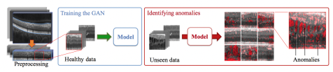

 

Tested fot detecting anomality on a single cup.

|
cup normal|
cup contaminated|
|--|--|
|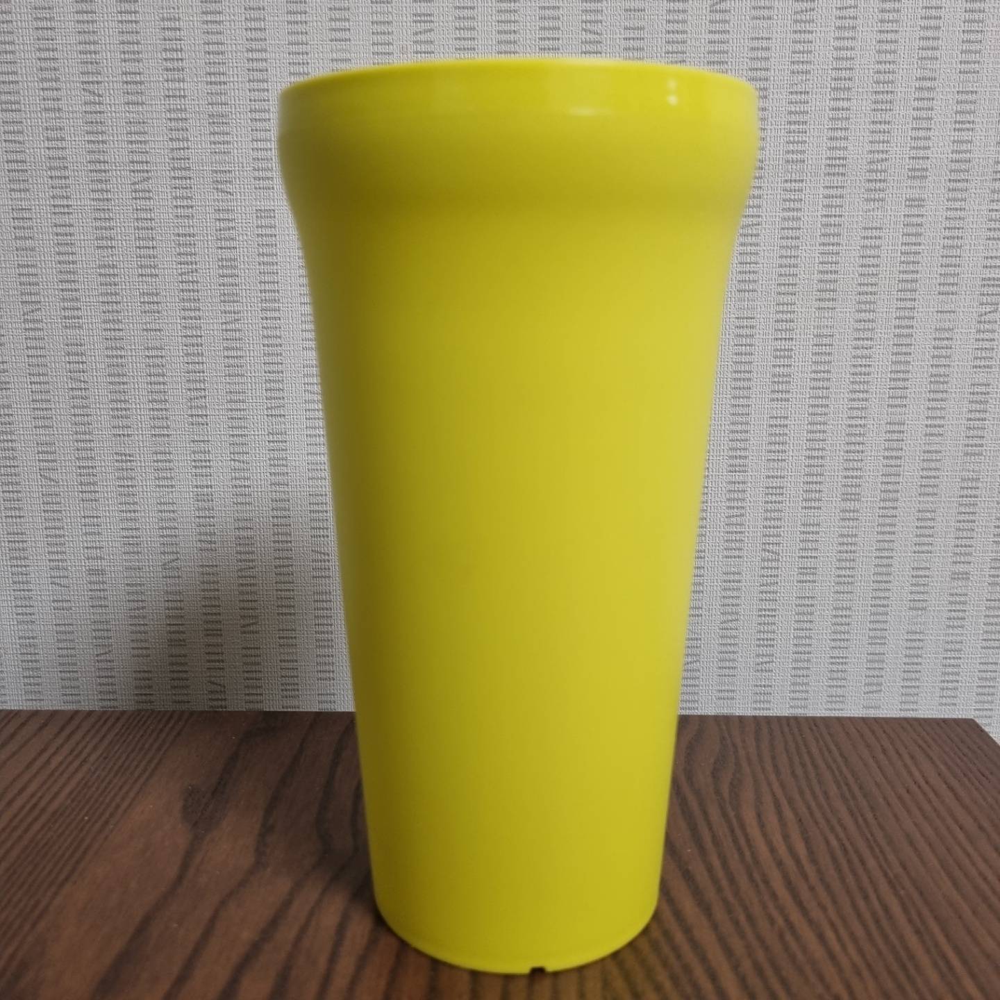|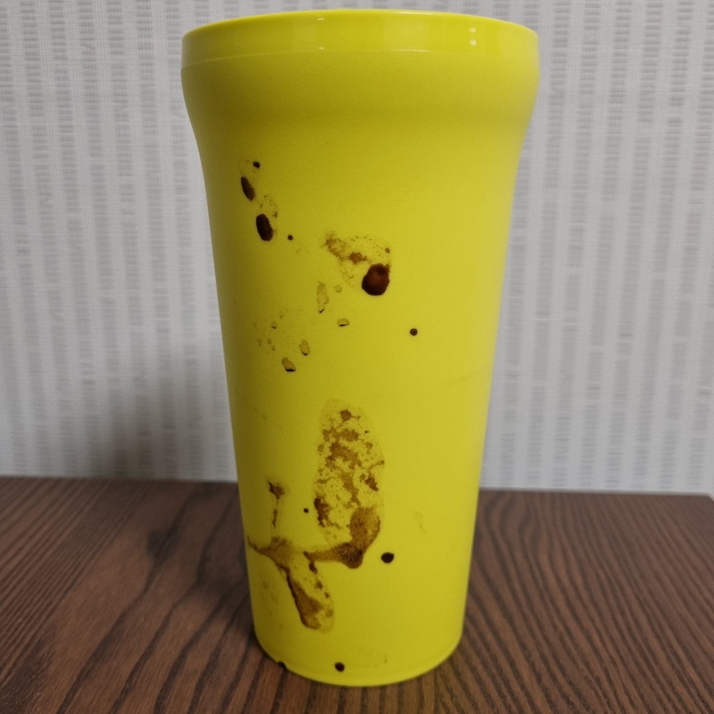|

## Training with DCGAN

paper: [DCGAN](/home/junshick/Workspace/Study/GAN/DCGAN/images/nomal_cup.jpeg)
- First, this model is trained with DCGAN
- Anomally detection is executed at inference session.
- Image size is resized to 64x64 and applied general convolution generator and discriminator
- Trained with 67 normal cup images.

    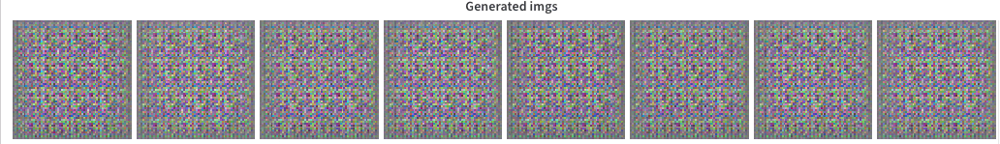

 

## Inference (Anomally Detection)

- Train latent vector so that D(G(z)) looks as much simillar as input x.
- Show difference between generated fake image and real image with anomally score.

    |
real image|
generated image|
difference|
    |--|--|--|
    |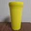|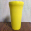|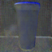|
    |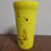|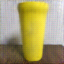|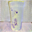|
    |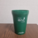|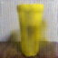|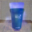|

